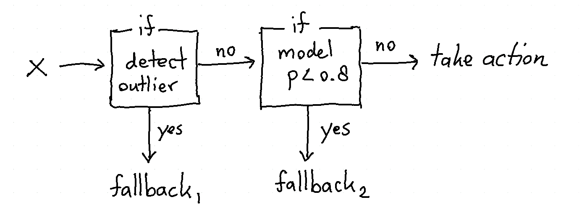

# human learn commands and snippets
Code along with https://calmcode.io/human-learn/introduction.html <br>

*"Human-Learn contains scikit-learn compatible tools that should make it easier to construct and benchmark rule based systems that are designed by humans. You can also use it in combination with ML models. In this series of videos we'll demonstrate some of the features."* - Vincent, calmcode.io




## Install human-learn
Check project here at https://github.com/koaning/human-learn

    pip install human-learn


## Draw!
*""You can use human-learn to literally draw a machine learning model. This is a great feature if you're interested in benchmarking the domain knowledge of your colleagues.* - Vincent, calmcode.

``` 
pip install scikit-lego
```

